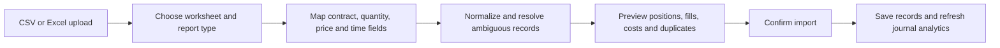

# Indian options journaling — implementation plan

Status: proposed work only. Prepared on 16 September 2026 against repository revision `8ca6d94`. No application code, database schema, imports, or user records were changed for this plan.

## 1. Product direction

Build options journaling into the existing journal. A trader should be able to record a simple NIFTY call in one form, upload a broker workbook, or review an adjusted spread without needing a live option chain.

Use three concepts consistently:

- **Contract:** what was traded — exchange, underlying, expiry date, strike, and CE/PE, with the applicable lot size recorded.
- **Position/leg:** one directional holding in that contract, with its entries, exits, costs, and notes.
- **Strategy:** an optional group of related legs, such as a spread or iron condor, including subsequent adjustments.

Recommended approach: extend the existing `Trade` model as the leg, add execution records when implementing detailed entry/imports, and add an optional strategy group. Reuse accounts, journal notes, playbook snapshots, filters, analytics, and the current AI workflow. A separate options application or a live market-data service is unnecessary.

| Approach | Tradeoff | Decision |
| --- | --- | --- |
| Add more fields to the current flat trade only | Smallest first change, but still loses execution timing and cannot properly account for adjusted strategies | Useful for phase 1, insufficient as the final model |
| Extend trades with fills and optional groups | Preserves existing data and UI while adding accurate accounting where needed | Recommended |
| Replace the journal with a full instrument master and portfolio ledger | Larger migration and operational burden before users can journal a simple option | Defer unless later requirements establish a need |

Manual entry and CSV/TSV/XLSX uploads are the primary inputs. All prices, marks, Greeks, settlement values, and broker charges must come from supplied records or explicit user entry. Historical contracts remain recordable even if they are no longer offered by an exchange.

## 2. What the application supports today

These are code observations, not claims that the complete options feature is already implemented.

| Area | Existing behavior | Gap to address |
| --- | --- | --- |
| `backend/db.py` → `Trade` | Stores exchange, segment, expiry, strike, CE/PE, lot size, long/short, quantity, notes, and costs | No separate underlying versus broker contract symbol; no expiry series, execution history, strategy relationship, or settlement lifecycle |
| `backend/schemas.py` → `TradeInput` | Indian derivatives require expiry and lot size; options require strike and CE/PE; quantity is units in whole lots, multiplier is 1 | Options can still use an inconsistent segment; expiry is not checked against execution dates; no structured contract context or entry/exit allocations |
| `backend/analytics.py` | Decimal-based calculations from a single entry and average exit, including partial realized quantity | Cannot correctly attribute multiple exits to different dates, or replay interleaved entries/exits from individual fills; risk assumes the supplied stop is a premium price |
| `backend/importer.py` | CSV/TSV/XLSX position import, mappings, option fields, normalization, duplicate fingerprints | Raw executions must already be matched into positions; only the active worksheet is read; broker symbols are not decoded into contracts |
| `src/Journal.tsx` | Generic derivatives fields within the existing trade editor | No lots/units toggle, option-specific language, leg builder, execution timeline, or useful contract summary in the journal row |
| `src/Analytics.tsx` → Options tab | Displays an options table and custom Greeks | **Existing defect:** expiry, strike, and option type are read from `attributes`, although they are dedicated trade fields; valid saved values can display as missing |
| `backend/repository.py`, `FilterInput`, `QueryPlan` | Generic trade filtering and dimensions | No exact underlying/expiry/CE-PE/strategy filters or options breakdowns |
| `backend/ai_evidence.py` | Detailed records include existing contract fields, with selective retrieval and notes | No strategy context, options filter vocabulary, structured Greeks, or execution/settlement explanations |
| `backend/journal_routes.py` | Trade CRUD, analytics, import preview/commit, CSV export, backup | All assume the current flat trade shape; must share the new calculation path before execution support is exposed |

The current units rule is worth preserving: `quantity` is actual option units, and lot size must not be multiplied into P&L a second time.

## 3. Indian contract rules that affect the design

Verified against exchange sources on 16 September 2026. These are planning references, not a promise that an online contract catalog will be maintained. Recheck applicable circulars when implementation begins.

| Topic | Relevant exchange behavior | Product consequence |
| --- | --- | --- |
| NIFTY | Weekly and monthly expiries, with longer-dated series also available | Support the actual expiry date plus an optional series label; do not limit storage to weekly/monthly |
| BANKNIFTY | Current specifications provide monthly and quarterly series. Its last weekly expiry was 13 November 2024 | Accept historical weekly trades; do not offer current BANKNIFTY weekly contracts as a default |
| Stock options | NSE specifications describe monthly contracts on eligible securities | Accept any supplied historical stock-option contract, including a symbol absent from a current suggestion list |
| Expiry changes and holidays | Current NSE specifications use Tuesday expiries, adjusted for trading holidays; the 2025 circular documents the transition | Store actual dates. Never derive historical expiry solely from today's weekday convention |
| Lot sizes | Changes can depend on contract expiry and effective date, and can affect existing longer-dated series | Snapshot applicable size with executions; a single permanent `NIFTY = x` or `BANKNIFTY = y` constant is insufficient |
| Settlement | Index-option cash settlement and physically settled stock options need different recording paths | A stock option held to expiry must not automatically become a zero-price exit |
| Corporate actions | Strike, position quantity, and market lot can be adjusted | Preserve original terms and explicit adjustments; do not overwrite past executions |

Sources: [NSE contract specifications](https://www.nseindia.com/static/products-services/equity-derivatives-contract-specifications), [weekly discontinuation circular](https://nsearchives.nseindia.com/content/circulars/FAOP64506.pdf), [expiry transition circular](https://nsearchives.nseindia.com/web/sites/default/files/inline-files/FAOP68747.pdf), [lot-size revision example](https://nsearchives.nseindia.com/content/circulars/FAOP70616.pdf), [individual-security options](https://www.nseindia.com/static/products-services/equity-derivatives-individual-securities), [index-option settlement](https://www.nseclearing.in/clearing-settlement/equity-derivatives/settlement-mechanism), and [corporate-action adjustments](https://www.nseindia.com/static/products-services/equity-derivatives-corporate-actions-adjustments).

Source precedence matters: the general NSE Clearing settlement page contains broad older cash-settlement language. Use the current individual-security specifications and applicable circulars for stock options, rather than applying that general wording to them.

**No live contract lookup is required.** Explicit workbook columns or confirmed user values are sufficient. A later optional upload of a dated contract-reference file may help resolve symbols, but it must never become a requirement for adding a trade. Suggestions are not proof that a contract existed.

Treat BSE index options as a later adapter using the same contract model. Do not apply NSE expiry assumptions to BSE. MCX options and their possible devolution into futures need a separate specification and are outside this equity/index-options release.

## 4. Scope and rollout boundaries

| Capability | Planned delivery |
| --- | --- |
| Bought/sold calls and puts; index and stock options; exact dates, strikes and contract sizes | First release |
| Manual entry and position-summary spreadsheet import | First release |
| Multiple entries/exits, partial closures and raw execution imports | Second release, built on the first release's contract model |
| Multi-leg strategies, hedge legs, adjustments and rolls | Third release |
| Explicit expiry outcomes, stock delivery and corporate-action reconciliation | Fourth release; earlier releases must visibly leave these unresolved |
| Options analytics and useful AI evidence | Introduce with the first release and extend at every phase |
| Live quotes/chains, broker login/sync, order placement, automatic Greeks, live margin calculations | Outside this plan |
| Tax return preparation, F&O tax turnover certification, automated statutory rate calculations | Outside this plan; record actual broker charges instead |

A first release can journal closed stock-option trades without claiming to handle their full delivery lifecycle. Do not market full stock-option expiry handling until its reconciliation gate passes.

## 5. Contract identity and data rules

### Contract fields

| Field | Rule |
| --- | --- |
| Exchange | Explicit NSE/BSE; keep separate from broker |
| Underlying | Canonical symbol such as `NIFTY`, `BANKNIFTY`, or `RELIANCE`; a suggestion list must allow manual values |
| Underlying kind | Index or stock; determines the options segment |
| Broker symbol | Preserve the original trading symbol separately, including its source broker |
| Expiry | Actual calendar date, not a month name or a weekday formula |
| Strike | Positive exact decimal; allow adjusted/fractional strikes |
| Type | CE or PE; show Call/Put alongside the abbreviation |
| Lot size | Positive integer applicable to this contract at the recorded time |
| Expiry series | Weekly, monthly, quarterly, half-yearly, other, or unknown; imported/confirmed with provenance |
| Settlement mode | Cash, physical, or unknown; distinguish recorded terms from suggested defaults |
| Provenance | Manual, explicit import columns, confirmed symbol parsing, or a dated reference file |

Use `(exchange, underlying_kind, underlying, expiry, strike, option_type)` as the ordinary contract identity within an account's matching scope. Broker symbols are aliases. An explicit adjustment creates a linked contract revision when necessary.

Do **not** include weekly/monthly labels in the identity. A contract can reach the near-month window after being introduced as a longer-dated series. Do not duplicate it because a workbook uses a different series label. Preserve recorded classification/source, show unknown when unresolved, and keep optional month-end reporting separate from original series classification.

Normalize `BNIFTY` and `BANK NIFTY` to `BANKNIFTY` only when they identify the underlying. Do not blindly alter an opaque broker symbol or deduce the underlying from a broad substring search.

### Quantity and monetary conventions

- Accept either lots or units in the UI/import, with an explicit unit choice. Store units as the authority.
- `units = lots × applicable_lot_size`. The UI displays both, e.g. `2 lots · 100 units` using a clearly synthetic 50-unit example.
- Preserve `multiplier = 1` for these Indian equity/index options; hide that generic field in the options form.
- Prices and strikes are INR per unit. Preserve decimal precision through parsing and calculations; round displayed money separately.
- Normal fills require whole lots using the size effective for that fill. Broker-supported corporate-action adjustments can use a reviewed exception; never relax normal validation silently.
- Zero is a valid expiry/exit value and manual mark. It is different from missing data. Ordinary executed entry premium must be positive.
- Distinguish buying/selling the option from bullish/bearish market intent. A bought put is a long option position, not a short position in the journal's P&L formula.

### Validation

Block internally impossible records: missing contract identity, negative units, invalid CE/PE, incompatible asset/segment, mixed currency, closing more than available units, or an ordinary execution after a confirmed expiry.

Allow a later booking date for a settlement or correction; it is not a normal post-expiry execution. Keep execution time, expiry date, and settlement booking date distinct.

Treat an uncertain historical lot size, unfamiliar broker symbol, or unusual series label as a reviewable data issue. Show the exact field to confirm, rather than rejecting a historical trade because a current catalog lacks it. Where only series classification is missing, allow journaling and exclude it from series-specific comparisons.

## 6. Proposed backend model

This is a schema design for later implementation, not a migration to run now. Introduce tables only in the phase that uses them.

### Extend `Trade` as one position/leg

Keep existing IDs, notes, tags, account relationships, and saved playbook snapshots. Add typed fields for underlying, underlying kind, broker symbol, expiry series/source, settlement mode, original quantity unit (lots/units), contract-resolution status, and a revision for optimistic concurrency.

Add `calculation_basis = summary_v1 | fills_v1`. Existing records remain `summary_v1`; their saved average-price semantics and historical P&L must be preserved. Detailed trades use `fills_v1` and obtain their calculations from executions.

Add optional `strategy_id`, `mark_as_of`, `mark_source`, and typed optional context for premium-stop versus underlying-stop, planned INR risk, capital/margin supplied by the user, and Greek observations. Optional context can be validated JSON when it is not used for indexed filtering. Contract identity and relationships belong in typed columns, not arbitrary attributes.

Use `date` for expiry once existing values have been checked for conversion, `timestamptz` for execution/observation times, exact `numeric`/Decimal for premiums and amounts, and integer units for new Indian option executions. Existing generic trades may retain fractional quantities for other asset classes. API dates can remain ISO strings.

Do not copy the current `Numeric(..., asdecimal=False)` and float parsing into new authoritative option calculations. Convert at the display boundary only; adopt decimal strings for new money input contracts if necessary.

### `trade_fills` — phase 2

One row represents a fill allocation to a leg: tenant/account/trade identity, buy/sell, units, premium per unit, execution timestamp or explicitly date-only precision, lot-size snapshot, charges, source item, allocation index, and correction metadata.

Retain source execution/order identifiers. Order IDs alone are not unique fills. If a source execution closes one position and opens the reverse position, split its allocation across two legs while preserving its single source identity and conserving both units and fees.

Fill history becomes authoritative for detailed trades. Parent entry/exit averages are compatibility/display projections, not a second editable source. One service rebuilds quantities, matched costs, realized events and summary values in the same transaction as a fill change. Every reader, including AI evidence, uses that result.

### `option_strategies` — phase 3

Tenant/account, name, strategy type, notes/tags, planned risk, optional capital snapshot, playbook snapshot, revision, and lifecycle timestamps. A trade belongs to at most one strategy by default; this avoids counting the same leg in two strategy totals. A roll keeps old and new legs visible within the strategy, with an explicit replacement relationship where applicable.

A strategy is a grouping and review object. It does not contain a second copy of its legs' P&L. Initially require one account per strategy; cross-account portfolio hedges are a separate feature.

### Import provenance — phase 2

Add `import_batches` and `import_items` for execution imports: owner/account, broker, file hash, worksheet and row identity, parser version, supplied/normalized values, preview revision, and commit status. These records support retries, corrections, allocation reconciliation, and duplicate detection.

Prefer unique broker execution IDs scoped by tenant/account/broker and, where needed, trading date. For files without IDs, fingerprints identify possible duplicates, not unquestionable duplicates: two genuine fills can have identical time/price/quantity. Preview must allow the trader to retain both.

### Settlement and adjustment events — phase 4

Add typed `option_events` linked to the leg: event kind, effective date, booked time, quantity, supplied settlement terms, financial adjustments, related stock-trade ID if present, source, and revision. Validate the payload by event kind. Events must explain corrections without destroying original contract/fill information.

For all new tenant tables, use the existing private `journal` schema, tenant session, FORCE RLS and `app.user_id` policies with both read/update conditions and write checks. Browser roles receive no direct access. Use tenant-qualified foreign keys so neither another user's strategy nor another account's fill can be attached accidentally. Add indexes for parent joins and the actual filters, initially owner/account/time, owner/underlying/expiry, and owner/strategy. Continue using the repository's Alembic chain.

Do not create a global instrument master, separate service, event bus, or generic accounting platform for this feature.

## 7. Calculation authority and accounting boundaries

### Simple positions

For a completely closed position with one entry basis:

`gross P&L = (exit premium − entry premium) × closed units × direction`

Direction is +1 for bought options and −1 for sold options. Net P&L deducts recorded costs exactly once. Strike price is not used as the entry premium, and lot size is not another multiplier after conversion to units.

Synthetic examples, independent of current exchange lot sizes:

| Example | Expected result |
| --- | --- |
| Buy 2 lots of 50 units at ₹100, sell at ₹130; ₹100 total costs | ₹3,000 gross, ₹2,900 net |
| Sell 100 units at ₹120, buy back at ₹80; ₹60 costs | ₹4,000 gross, ₹3,940 net |
| Buy 50 units at ₹20, explicitly confirm worthless expiry; ₹30 costs | −₹1,000 gross, −₹1,030 net |

### Multiple fills and dates

Default new execution imports to deterministic FIFO matching within account, contract/revision, and compatible position context. It is a journal calculation policy, not a claim about tax accounting or every broker's display method. Store the policy/version and show differences against a supplied broker P&L instead of overwriting one with the other. Broker-linked matching can be supported when the file provides reliable links.

A position episode runs until its signed quantity reaches zero. A later reopening becomes another leg/episode. A roll to another strike or expiry always creates a new leg. Raw fills alone do not prove that separate legs are one strategy; suggest grouping for confirmation.

Partial-exit P&L belongs to each exit's date in IST. Charge allocation must be deterministic: matched opening costs plus the closing fill's costs go to realized P&L; unconsumed opening costs remain with open inventory. Residual paise are allocated deterministically so totals reconcile. Daily cash fees/premium movements, if later shown, must be labelled separately from this realized-performance view.

Example acceptance case: buy 100 units at ₹100, close 50 at ₹120, buy another 50 at ₹80, then close 100 at ₹110. FIFO gross results are ₹1,000 at the first exit and ₹2,000 at the final exit, total ₹3,000. Do not apply one newly averaged entry price retrospectively to the first exit.

Date-only records must retain that precision. If same-day fill ordering changes matching and the source has no sequence, ask for an order or use an explicitly confirmed position summary; do not manufacture an intraday timeline.

### Costs and risk

- Capture actual brokerage, STT, exchange charges, SEBI fees, GST, stamp duty, and other charges when available. A total-only import remains usable.
- Store whether a total already includes the breakdown. Never add both. Missing costs are unknown, not a confirmed zero; label net performance accordingly.
- A daily broker charge total may be allocated only with an explicit documented allocation method; preserve the original total and reconcile the distributed amount. Estimates must be labelled.
- Keep planned risk, theoretical payoff risk, premium paid, and margin/capital employed separate. Received premium is not an option seller's maximum risk or capital base.
- Underlying-price stops cannot be subtracted from option premiums to compute R. R is unavailable unless a valid premium stop or explicit planned INR risk is recorded.
- Fixed-expiry payoff bounds are available later only for supported, complete structures with known quantities. Do not show a finite maximum loss for an uncovered short call. Calendar/diagonal strategies require assumptions beyond a single expiry-payoff line.

### Marks, expiry and delivery

Open P&L requires a supplied mark with its observation time. Never substitute today's price, zero, strike, or the last recorded entry as a missing mark. Strategy unrealized totals must identify missing or incompatible-time marks rather than presenting a partial sum as the whole strategy.

When expiry passes, show **Settlement details needed** if the outcome is unknown. Time passing alone does not authorize a zero exit.

- Squared off before expiry: use actual closing fills.
- Worthless expiry: require user confirmation or a clear broker event; close at zero with recorded charges.
- Index cash settlement: require a supplied settlement value or explicitly confirmed official underlying settlement value. If deriving intrinsic value, record that basis and distinguish it from a market fill.
- Stock exercise/assignment: record delivery quantity/direction, strike consideration, premium basis, charges and linked stock position when supplied. Do not fabricate a cash-settled option profit and also adjust stock cost by the same premium.

Delivery directions to validate in phase 4: long call receives shares, short call delivers shares, long put delivers shares, short put receives shares. The recommended journal convention transfers option premium basis to the linked stock acquisition/disposal; until reconciliation is complete, show the option outcome as awaiting delivery reconciliation and exclude it from completed-option win rates. If a broker report books a separate option result, preserve its reporting basis and avoid adding it to the transferred basis again. Exact reporting adapters and reconciliation examples are a phase-4 prerequisite, not a tax-basis claim.

Corporate actions and contract-size revisions must preserve before/after terms and economic value through an explicit event. Do not reapply the latest lot size to historical fills. Unresolved adjustments remain visibly incomplete rather than generating misleading gains or losses.

## 8. Manual entry and journal UI

Keep **Add trade** as the entry point. Choosing Options changes the relevant fields and labels; do not require the trader to create a strategy first.

Recommended form order:

1. Account and exchange; Index option or Stock option; underlying.
2. Expiry date, strike, Call/Put; optional series classification.
3. Bought option or Sold option; lots/units with the applicable lot size and live conversion preview.
4. Entry premium/time and close/open state. Phase 2 adds **Add entry** and **Add exit** rows without making the simple case longer.
5. Recorded charges, optional risk plan, setup and journal notes. Advanced context stays collapsed.

Show the assembled contract prominently: `NIFTY · 29 Sep 2026 · 25,000 CE`, with account, quantity and series beneath it. It describes the entered record; it is not a live availability claim.

For multi-leg entry, offer **Add another leg** and an optional strategy template. Templates only prefill structure and labels. Users supply premiums, quantities and dates, and can choose Custom. Start with vertical spreads, straddles/strangles and iron condors; preserve arbitrary leg groups without pretending every combination has a supported payoff calculator.

Journal rows should distinguish the contract, bought/sold side, lots/units, expiry and realized outcome. Strategy view expands into its legs and adjustments. Show `1 strategy · 4 legs` rather than implying four independent trading decisions.

Trade detail gains an execution timeline, costs, contract details, risk basis and related legs. Distinguish premium stop from underlying stop in plain language. Greeks and IV use optional labelled inputs, not JSON editing.

Mobile uses stacked leg cards and expandable detail. Core text must remain readable and controls keyboard accessible; verify Chrome and Safari on the implemented forms and menus. Do not expose parser internals, database field names or model/token limits to customers.

## 9. Spreadsheet import workflow

Preserve the existing inspect → map → preview → commit experience, but explicitly distinguish **position summary** from **execution tradebook**. A P&L report with average buy/sell values cannot reliably reconstruct entry side, sequencing, or strategy intent; do not infer these when the report does not contain them.

Build two documented generic templates first:

- **Positions:** account selected in UI; exchange, underlying/kind or confirmed broker symbol, expiry, strike, CE/PE, side, quantity plus quantity unit, lot size, entry premium/time, optional exit premium/time, closed units, charges, setup and notes.
- **Executions:** broker trade ID if present, order ID if present, contract fields, buy/sell, units or explicit lots, lot size, execution date/time and precision, premium, charges, optional product and user strategy reference.

File-handling changes: worksheet/header-row selection, Excel date cells and serial-date normalization using workbook date conventions, Indian dates/times, separators and currency symbols, blank/footer rows, and formula cells without cached values. Never execute formulas or macros. Keep upload/expanded-workbook limits and spreadsheet-safe export behavior.

Preserve broker identifiers as text; spreadsheet numeric coercion must not round long trade IDs. Separate exchange execution time from a report-generation timestamp. MIS/NRML and similar broker product labels are useful context, but a broker product conversion alone is not proof that a position closed and reopened.

Contract resolution order: explicit mapped fields → tested broker-format parser → user confirmation. Conflicts between explicit fields and a decoded symbol must be shown in preview. Encoded weekly/monthly symbols vary; use broker-specific fixtures instead of one broad regex. Lot size often cannot be recovered from the symbol alone.

Quantity mode must be explicit. An ambiguous `Qty`/`Contracts` header is insufficient to decide lots versus units. Let users apply one choice or a supplied lot size to a selected group of contracts, with per-row exceptions. Do not apply today's lot size to every historical row.

Preview shows resolved contracts, units/lots, bought/sold side, opens and closes, fees, computed versus supplied P&L, duplicates and unresolved rows. Only ask about missing or conflicting inputs. Group repeated issues so 100 rows do not produce 100 separate prompts.

For raw fills, support open positions across files and overnight dates. A closing sell with no opening inventory may be a short entry or an exit whose earlier history is missing. Confirm that distinction or add a labelled opening-balance position; never invent the missing entry premium.

Commit must revalidate the preview revision and existing position state, use tenant-scoped idempotency, and save each matched position/allocation group atomically. If users choose to skip invalid rows, related fills must remain visibly unmatched rather than being silently treated as a complete position. Re-uploading a positions report and a tradebook for the same trades needs a conflict/replacement preview, not two copies of P&L.

Implement broker adapters from actual redacted export fixtures. Start with the first two broker formats the user supplies; the current list of broker names is not evidence that their exports are already supported. Unknown layouts retain manual mapping. Store parser version and source-row references for explainable corrections. Define retention for raw uploads; avoid retaining complete workbooks indefinitely when normalized source rows suffice.

## 10. Analytics and AI integration

### Deterministic analytics

Add filters/breakdowns for underlying, index/stock, CE/PE, option buying/selling, expiry date/series, days to expiry at entry, expiry-day trades, and strategy type. Weekly/monthly comparisons must report unknown classifications separately.

Define DTE initially as calendar days between the entry's IST date and the actual expiry date. Zero DTE means the same IST date; it does not require intraday timestamps. Do not call this trading days to expiry. Exact holding time is unavailable for date-only sources.

Use a visible **Positions / Strategies** counting choice. A fully closed four-leg condor is one strategy outcome and four leg outcomes in their respective views. A partially closed strategy can contribute realized P&L, but is not yet a completed-strategy win/loss. Ungrouped options remain individual positions. Account totals count financial events once; grouped totals never get added on top of leg totals.

Separate selection by entry period from realized cash-result dates. The current global entry-date filter should keep its meaning; a future period-performance view must also include exits during the period from positions opened earlier. Daily charts consume realized exit events for detailed trades, not just the final exit date.

Optional supplied underlying prices permit moneyness/intrinsic comparisons. Without them, show unavailable. IV and Greek observations need as-of time, source and units; distinguish decimal IV from percent IV and per-unit from per-lot Greeks. Aggregate Greeks only for compatible units/times. No inferred IV crush, theta attribution, option liquidity or MAE/MFE from entry/exit prices alone.

### Existing AI workflow

Extend the current planner → deterministic evidence → answer flow. Do not add agents just because these are options. Calculations and matching belong in code.

Update `FilterInput`, `QueryPlan`, `EvidenceFilters`, and backend retrieval together. The planner can request a contract/expiry/strategy cohort; evidence supplies exact summaries plus relevant leg details, notes, risk basis, fills and adjustment context.

Examples the implementation must answer correctly:

- “Review my last 20 NIFTY option trades”: select 20 positions before reading details; send their useful records and notes, not the whole journal.
- “How did my last 10 iron condors perform?”: select 10 strategies and retrieve their legs; do not treat 10 fills as 10 strategies.
- “Compare my weekly and monthly buying”: use recorded series and option side, report missing classifications and sample sizes.
- “Why did I lose on this roll?”: show the closed old leg, new leg, costs and journal rationale; do not describe a roll as undoing the earlier loss.
- “Was IV crush the reason?”: identify whether suitable supplied IV observations exist; otherwise avoid a causal claim.

Preserve current workflow credit buckets, usage accounting, streaming and concise clarification behavior. No AI charge for contract parsing, P&L, import validation or deterministic analytics. Broader reviews retain full-cohort metrics and relevant individual evidence; no new arbitrary trade-count cap. Treat imported notes as data, never tool instructions. All evidence remains tenant/account scoped.

## 11. API, files and administration

Proposed public API evolution:

- Extend existing `/api/trades` and analytics filters additively for phase 1; existing clients keep working.
- Add `/api/trades/{id}/fills` for phase 2, using idempotency and expected revision on writes. Once fills exist, prohibit contradictory average-price edits through the old trade endpoint.
- Extend import inspect/preview/commit with report type, worksheet, quantity mode and a preview identity/revision.
- Add `/api/option-strategies` and detail/membership operations in phase 3. Membership changes must validate ownership/account and refresh affected projections.
- Add settlement/adjustment operations only in phase 4, with event-specific inputs and recorded confirmations.
- Extend CSV export with clear contract and quantity semantics, add execution/strategy export where needed, and version the JSON backup format so no child records are lost.

| File/area | Planned change |
| --- | --- |
| `backend/db.py`, `backend/schemas.py` | Additive typed contracts, revisions and phased child records |
| `backend/markets.py` | Underlying aliases and contract conventions; no permanent current lot-size defaults |
| New `backend/options.py` | Contract normalization, labels, validation and optional observed context |
| New `backend/position_accounting.py` | Fill matching, cost allocation, realized events and projections; used by every reader |
| `backend/importer.py`; later `backend/import_adapters/` | Report types, workbook selection, contract parsers and provenance |
| `backend/journal_routes.py`, `backend/repository.py` | Shared reads/writes, options filters, import commit, exports/backup |
| `backend/analytics.py` | Execution-aware results, strategy counting, options dimensions and missing-data coverage |
| `backend/ai_contracts.py`, `backend/ai_evidence.py`, `backend/ai.py` | Options selection vocabulary and grounded evidence |
| `src/Journal.tsx`, proposed `src/OptionFields.tsx`, `src/OptionStrategyEditor.tsx` | Progressive manual form, contract labels, fills and strategy views |
| `src/Import.tsx`, `src/Analytics.tsx`, `src/types.ts`, `src/lib.ts` | Mapping/preview, options analytics, shared contracts and filters |
| `src/Dashboard.tsx`, `src/Calendar.tsx`, `src/Coach.tsx` | Consistent scope, counting unit and dated realization across consumers |
| `backend/admin.py`, `src/Admin.tsx` | Minimal options import diagnostics and any future reference-file management |
| `migrations/versions/` | New reviewed Alembic revisions only, generated at implementation time |
| `public/`, `tests/fixtures/options/`, focused tests | Generic templates and redacted/synthetic broker fixtures |

Administration should show failed import stage, parser version, unresolved count and safe diagnostics. Support should not receive unrestricted workbook or note access. Any later contract-reference upload needs a source date, effective scope, validation preview and audit trail; changing reference metadata must not rewrite historical trades. No new pricing controls are needed for deterministic options journaling.

## 12. Migration and compatibility

1. Start with a read-only inventory of existing option data: symbol usage, missing dedicated fields, expiry formats, attribute-based duplicates, and current P&L totals. This inventory is future work; no live user data was read for this plan.
2. Backfill only unambiguous facts. Preserve raw symbols, attributes and old values. Do not infer missing Greeks, fills, lot sizes or strategy groups from notes.
3. Keep old `summary_v1` calculations intact. A user can later replace a summary with confirmed executions using an explicit reconciliation preview. Do not present synthetic fills as actual broker executions.
4. Build the shared calculation/read interface before enabling fills. The current direct `Trade` column projections in AI evidence must not bypass execution results.
5. Enable each capability behind a small release flag. Once new detailed records exist, disabling writes must still allow compatible read/export access; never fall back to old average-price calculations for them.
6. Run migrations and rollback/recovery checks in a test environment first. Preserve raw source lineage and rebuildable summaries. Reverse an import through an explicit batch operation that protects later linked edits; do not silently delete records on re-upload.
7. Export/backup must include strategy membership, executions, observation units/timestamps and settlement links. A flat summary CSV alone is not a complete backup of a strategy.

## 13. Acceptance gates and implementation order

### Phase 1 — reliable contract journaling

Deliver contract identity, clearer manual form, exact quantity handling, position-summary templates/import, dedicated-field Options table fix, basic filters, and the first useful options evidence. No fill matching yet.

Gate: saved option details survive edit/export/import; current and historical supplied contracts work; existing non-option P&L is unchanged; no missing mark/series/cost is silently replaced by zero or a guessed value. Unsupported settlement states are clearly unresolved.

### Phase 2 — executions and import reconciliation

Deliver child fills, shared accounting, multiple entries/exits, raw tradebooks, source identities, duplicate/conflict review, and exact exit-date analytics. Add the first fixture-backed broker adapters.

Gate: matched quantities and charges reconcile with source rows; partial-exit examples match hand calculations; re-upload/retry does not duplicate results; missing opening history is flagged; summary and detailed data cannot double-count.

### Phase 3 — strategies and adjustments

Deliver user-confirmed grouping, multi-leg editor, rolls, strategy notes/risk, appropriate count semantics, and strategy-aware AI. Payoff diagrams are an optional addition for supported complete structures, not a prerequisite for grouping.

Gate: a four-leg strategy produces one strategy result and four leg results; total account P&L is identical in either presentation; old and rolled legs both remain visible; incomplete marks and open legs do not become completed outcomes.

### Phase 4 — expiry, delivery and contract revisions

Deliver explicit worthless/cash settlement, stock delivery links, and confirmed corporate-action/lot-revision events. Validate with broker settlement examples before claiming complete coverage.

Gate: all four stock delivery directions, premium-basis treatment, contract adjustments and relevant costs reconcile without double counting. Expiry never auto-closes unknown positions at zero. Historical contract terms remain intact after reference updates.

### Focused verification matrix

| Scenario | Required assertion |
| --- | --- |
| Long call, long put, short call and short put | Correct option-side sign; no assumption that puts are shorts |
| Two lots versus equivalent units | Identical P&L; no extra lot multiplier |
| Historical BANKNIFTY weekly | Accepted with its real date/size; does not create current weekly suggestions |
| Weekly/monthly alias for the same contract | No duplicate identity or duplicate import |
| Two applicable sizes for the same underlying | Each fill uses the recorded terms; reference edits do not change history |
| Zero exit versus absent exit | Confirmed zero closes; absent data remains unresolved |
| Interleaved entries and exits | FIFO fixture above totals ₹3,000 gross on the correct dates |
| Identical-looking legitimate fills | Retain both when source IDs or confirmed allocations distinguish them |
| Fill crosses through zero into reverse side | Two episodes; source units and costs conserved |
| Intraday file followed by an overnight closing file | Existing inventory matched exactly once |
| Missing first leg of the history | Unmatched/review state, no invented entry price |
| Date-only data with ambiguous sequence | Precision preserved; no fabricated trade order |
| Four-leg strategy, unequal quantities, partial hedge closure, roll | Accurate leg/strategy totals and open exposure |
| Fees breakdown plus inclusive total | Deduct once; allocations sum to original charge |
| Underlying stop or missing risk | No fabricated R multiple |
| Incomplete marks/Greeks | Missing values and evidence coverage remain visible |
| Stock settlement/corporate action | Correct event linkage and no duplicated option/equity economic outcome |
| Concurrent edit and import commit | Stale preview rejected; retry/idempotency safe |
| Cross-tenant/account strategy/fill attachment | Rejected in API and database RLS/foreign-key checks |
| Existing stocks/futures/crypto and legacy option summaries | No unintended arithmetic or import behavior regression |
| AI latest-N positions/strategies | Correct cohort and relevant notes; no whole-journal retrieval by default |
| Desktop/mobile and Chrome/Safari | Readable contract/strategy views, working controls, usable import review |

Use deterministic unit/API tests and a small set of broker fixtures, plus a bounded frontend build and browser check per UI phase. Money examples should be independently calculated rather than derived from the implementation under test. Offline tests must not contact a broker or charge an AI request. PostgreSQL isolation/migration checks use a dedicated test database, not customer data.

## 14. Decisions to confirm when implementation starts

The recommended defaults above allow planning to finish without blocking questions now. Before writing import adapters, collect redacted real workbook examples and confirm:

- Which two brokers/report formats to prioritize, and whether they contain positions, executions, fees and settlement rows.
- Whether options traders want Strategies or Positions as their default options view. Keep both; do not silently change existing journal counts.
- Whether FIFO journal matching meets the expected reports or a supplied broker basis is required from the first execution release.
- Whether physically settled stock options are needed in the first public options launch or can remain explicitly unresolved until phase 4.

Start implementation with phase 1, then add fills before strategy accounting. This keeps the first useful release small while preserving a clear path to complete Indian options journaling.
