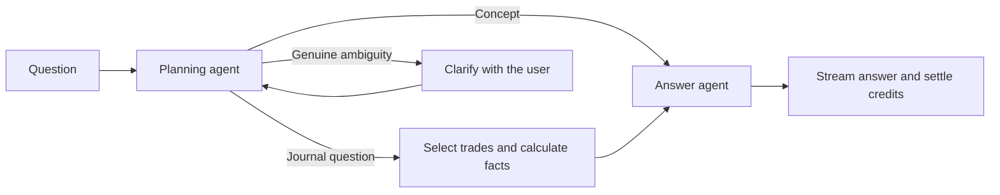

# AI reviews: selection, answers and credits

Updated 15 September 2026 after the “last 3 trades” failure and the subsequent comparison/Hi failure report. This document supersedes the earlier four-agent implementation. The original design/audit remain historical in [planning](planning/README.md) and [audit](audit/README.md).

## What was wrong

The evidence contract could filter dates and IDs but could not express “latest three.” A sequence request therefore loaded all matching rows. The mandatory investigator/reviewer loop amplified that input, and internal capacity exceptions were incorrectly presented as customer clarification questions. Token receipts, coverage hashes and bucket mechanics were also exposed in the customer experience.

## Current flow



There are two model roles: the planner chooses the evidence, and the answer agent reads it directly and produces the response. There is no mandatory investigator, reviewer, correction loop or repeated handoff. Feature-specific instructions cover chat, charts, performance summaries, coaching checks, next-session preparation and trade-note drafts. Deterministic tools retain ownership of arithmetic and tenant-scoped retrieval.

The planner gets at most two short prior messages. Concept questions query no trades. Specific numeric questions use metrics/groups without notes. General reviews require individual records with notes and rules, even if the planner chooses aggregate tools. The plan distinguishes `review` from `calculation`; omitted intent defaults to review, and clear latest-N review wording is bound by code. Selected trade drafts retrieve that trade only. The planner handles relative dates, filters and multiple comparison cohorts; an unambiguous explicit latest-N request is also bound by code if a planner omits its count.

## Trade selection and evidence

`TradeSelection` specifies count, newest/oldest order, entry/exit timestamp and offset. A plan-wide selection is resolved once and shared by all its tools; individual selections support comparisons such as the latest three versus the previous three. Known statuses and sides are normalized and validated. Closed-position questions exclude partial positions before choosing the cohort.

Ordinary latest-N queries apply ordering and LIMIT in SQL. Notes and rules are read only for the resulting IDs. Derived outcome/tag/check filters first select matching numeric rows, then apply the count, then fetch those selected notes. Dates use IST. The existing P&L, fees, partial-exit and undefined-R formulas remain authoritative.

Raw records only enter the answer call. Their lossless representation removes empty columns and shares repeated note/rule text. All requested records are sent when they fit: 80 is not a cap. If complete evidence cannot fit, each large cohort retains 80 detailed examples spread across outcomes, setups and recorded emotions, including period endpoints and extreme realized results. Exact metrics still cover every requested trade. Smaller cohorts retain all records. Further pressure uses labelled head/tail note excerpts; a metrics-only fallback remains for exceptional cases where even these records cannot fit the available allowance. The writer receives explicit sample coverage and cannot portray sampled notes as exhaustive or use them to estimate population statistics. No token-sized batches or additional compression agents are used.

Record evidence includes individual realized/gross/unrealized P&L, fees, risk, realized R multiple, prices, quantities, dates, setups, notes and recorded rules. Missing values remain unknown. Partial positions can have both realized quantities and an open remainder, so realized-position and open-position counts overlap. Internal logs record retrieved/included counts and representation types without printing journal content; public responses continue to omit operational metadata.

Capacity is handled internally. It never produces a “100k limit” question for the customer. If even a usable answer cannot be dispatched within the allowance, the review fails with a plain message and a refund. Provider outages and truncated outputs are also refunded; they are not turned into user questions.

## Exact credit policy

The smallest bucket containing **both** the total input and total output across all paid agent calls determines the charge. The two dimensions are not added as separate credit charges. There is no currency-rate formula and no rounding per agent.

| Input at most | Output at most | Credits |
| ---: | ---: | ---: |
| 8,000 | 2,000 | 1 |
| 16,000 | 4,000 | 2 |
| 32,000 | 6,000 | 3 |
| 64,000 | 8,000 | 4 |
| 128,000 | 16,000 | 7 |

The **workflow input limit is 100,000**, as confirmed by the user. The final pricing bucket covers 64,001–100,000 input tokens, or output above 8,000. The output limit is 16,000. For example, 5,000 input and 3,000 output costs 2 credits. 70,000 input and 4,000 output costs 7 credits.

Standard and Advanced use the same buckets; they select different configured models. Old task costs and the old Advanced multiplier do not determine prices of new workflows. Existing historical job prices remain unchanged. Playbook creation remains a separate non-AI fee.

Cached tokens are already part of input and reasoning tokens are already part of output. Neither is counted twice. Provider currency costs are retained in private call receipts for operational accounting; they do not set the user's credits.

Customers see “1–7 credits per review” and the final charge. Submission reserves the highest affordable bucket, up to 7 credits, automatically. Older clients with explicit smaller maxima remain supported. A successful answer settles the actual bucket and returns the remainder; a stop charges completed work; a failure refunds. No extra paid estimation call is made.

The planner disables optional reasoning and reserves most output for the answer. A confirmed pre-generation rejection from an endpoint requiring reasoning is corrected once with low effort; uncertain calls are never replayed. The answer uses the saved route's reasoning setting. Both stages share the whole-review input/output allowance. Input preflight uses an estimate (`o200k_base` plus headroom), followed by native usage verification; it is not an exact native-token promise before dispatch.

## Customer interface and Admin

Customer progress shows one simple current status and streams the answer. The receipt is only the final credit charge. Pricing, Help, onboarding, chat and trade-note screens contain no token tables, internal thresholds, agent counts or maximum selectors.

`ai_public.py` whitelists customer job/results, progress events and saved-message metadata. Historical usage events retain their cursor without their diagnostic payload; historical capacity pauses appear as resumable interrupted reviews. Backups also omit internal message metadata. Operational usage, pricing policy and saved model routes remain in the job records and are available through the restricted Admin API.

The existing durable job, event replay, revision, idempotency and wallet settlement protections remain. A clarification resumes the same review. Old budget/scope/limit pauses can resume the original question under the new graph; customers do not need to rewrite an already specific query. No automatic paid retry of an uncertain dispatched provider call is introduced.

Admin now labels the two model roles as Planning agent and Answer agent and explains automatic reservations and clarification-only pauses. Its exact bucket policy and diagnostic receipts remain visible to authorized staff. See [Admin guide](../admin/README.md).

## Verification

- Regression fixtures use 500 trades and assert that the exact reported question reads only the latest three notes, answers with two model calls and calculates totals from those same three.
- Selection checks cover newest, oldest, offsets, closed versus partial positions, case normalization, derived loss/tag filters, dates and tenant isolation.
- Customer API, SSE replay, saved history, catalog and backup checks reject internal token/coverage fields.
- Existing money checks cover mixed input/output buckets, settlement, stop, refunds, duplicate submissions and continuations.
- The PostgreSQL verification creates 500 temporary trades under a restricted tenant role, verifies latest-three retrieval and isolation, and rolls everything back.
- Two live synthetic questions (the exact request and a paraphrase about three most recently closed positions) selected the correct three out of 500 and completed with two model calls, no clarification and 2 credits each. The model output and receipts are in [verification/live-selection.json](verification/live-selection.json). These are real provider calls against synthetic data, not real customer journals.

Reproduction:

```bash
.venv/bin/python -m unittest discover -s tests -q
node --test tests/ai_stream.test.mjs
npm run build
.venv/bin/python scripts/verify_ai_db.py
.venv/bin/python scripts/verify_ai_selection.py --run
```

The final command incurs provider usage. The latest recovery check also verifies Advanced. Other configured models have not been exhaustively evaluated. The earlier live 50-trade receipt belongs to the superseded four-agent design.


Earlier selection/UI verification on 15 September 2026: **67 Python tests**, the SSE parser check, the production build, and PostgreSQL selection/settlement/isolation checks passed. Browser checks passed for streamed answers, genuine clarification, reconnection and trade-note append, with no page errors or horizontal overflow at 390px. [Desktop streaming](verification/stream-desktop.png) and [mobile receipt](verification/mobile.png) show synthetic test data.

Cancellation accounting is covered by backend tests. The concurrent browser cancellation fixture was not used as a PostgreSQL concurrency guarantee: SQLite lacks its row-lock behavior. No production database schema changes were required for this correction.

Implementation references: [LangGraph Graph API](https://docs.langchain.com/oss/python/langgraph/graph-api), [Supabase row-level security](https://supabase.com/docs/guides/database/postgres/row-level-security).


## Comparison and follow-up recovery

The saved failed jobs showed two distinct application defects:

- Standard returned plans with `selection: null` for both the comparison and “hi”. The contract incorrectly rejected that unused optional field. Optional nulls now mean the default, while required fields and invalid counts remain validated. Both original saved responses pass the corrected parser.
- Advanced rejected the planning request before generation because its endpoint requires reasoning. The runtime corrects only this explicit HTTP 400 parameter rejection once, using low effort. Other rejections, uncertain timeouts and failed streams are never automatically replayed.

A real synthetic reproduction then retrieved the correct 20 trades, but its saved 4,098-token route ceiling cut off the writer after reasoning used most of the allowance. The two affected chat routes were restored to 16,000 via `scripts/repair_chat_output_limits.py --apply`, with a maintenance audit and catalog revision updates. Other route fields and existing job snapshots are preserved. The shared 16,000 output limit and actual-usage pricing still apply; this does not force the model to consume the ceiling.

With those settings, a live Advanced comparison read exactly 10 closed winners and 10 closed losers out of 500 trades, completed with two agent calls and cost 1 credit. “Hi” in the same conversation then completed with two calls, zero trade retrieval and 1 credit. See [the synthetic report](verification/live-recovery-advanced.json). The Standard recovery check encountered HTTP 429 from its Alibaba provider; that remains an external availability limitation, not a passing live test. Its public endpoint catalog lists one provider. The earlier Standard latest-three checks passed before this rate-limit response.

The updated 74-test Python suite, SSE parser check and frontend production build passed. Customer errors now distinguish temporary service unavailability and confirm refunds. Failed reviews no longer retain the “Review in progress” title or stale stage text. A regression verifies that a failed plan refunds and the next chat can complete. Provider transport checks cover native usage after the finish frame, the precise mandatory-reasoning retry, credential redaction, and no replay after timeout or streaming failure.

The local launcher writes `logs/api.log`, `logs/worker.log` and `logs/frontend.log` while prefixing terminal output. The worker records job IDs, agent/model dispatch, generation IDs, usage, provider error explanations and validation field paths without dumping prompts or trade notes. Use `tail -f logs/api.log logs/worker.log` to follow requests. API code reloads automatically; restart `./start.sh` for worker changes.

```bash
.venv/bin/python scripts/verify_ai_recovery.py --run --tier advanced
.venv/bin/python scripts/verify_ai_recovery.py --run --tier standard
```

These commands call the real provider against an isolated synthetic journal. `--output-limit 4098` reproduces the previously constrained Standard route. The read-only `scripts/inspect_ai_failures.py JOB_ID...` checks selected stored jobs and parser diagnostics without sending another AI request.

Provider reference: [OpenRouter reasoning configuration](https://openrouter.ai/docs/guides/best-practices/reasoning-tokens).
