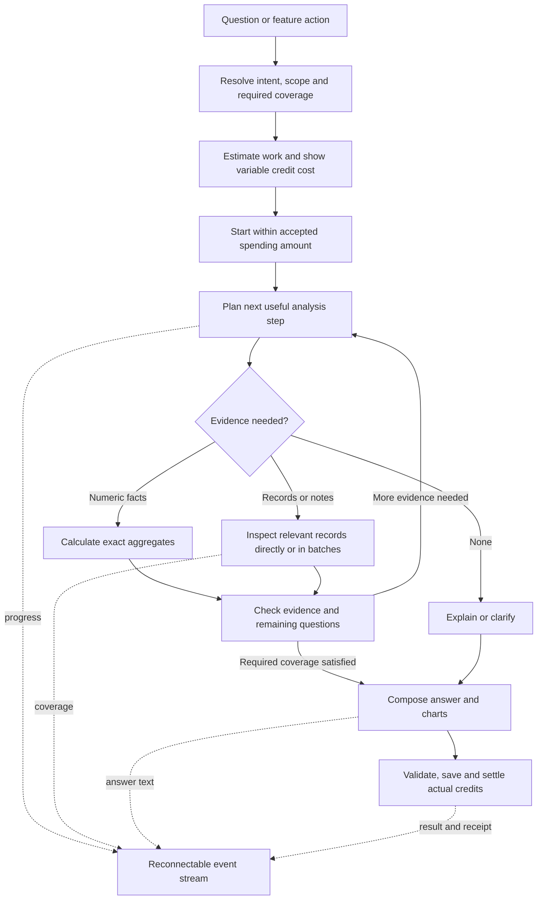

# AI redesign: adaptive analysis and usage-based credits

**Revised proposal — 14 September 2026. Planning only; no application or database changes have been implemented.**

This replaces the earlier proposal. Its per-feature token, trade, and call ceilings are withdrawn. They were not supported by quality measurements and incorrectly made existing fixed credit prices the design constraint.

The objective is to answer the actual question well, using the appropriate evidence and charging fairly for the work required. Journal size should not determine the prompt. The question, its scope, the available evidence, and the requested depth should determine the work.

## 1. The problem at its root

The current architecture couples three things that should be independent:

1. **Available data becomes starting context.** The backend retrieves a broad scope before understanding what the request needs.
2. **Every feature receives substantially the same representation.** Metrics, numerous grouped metrics, and recent records are bundled together even when only one is useful.
3. **A task label determines a fixed charge.** Chat costs the same whether it explains a concept or performs a substantial investigation.

Adding an agent loop around that bundle would preserve those problems. Replacing it with a tiny fixed bundle would create incomplete analysis.

Separate understanding the request, calculating facts, inspecting records, determining whether the evidence supports the answer, and metering useful work. Each feature provides a starting workflow and output contract. It does not prescribe an arbitrary amount of evidence.

Two kinds of growth must be distinguished:

- **Unrelated growth:** importing another 9,000 trades outside last week should not enlarge a last-week prompt or automatically increase its AI charge.
- **Relevant growth:** reviewing every note across 500 relevant trades can require more work than reviewing 50. Handle this efficiently and price it transparently.

An all-time scalar metric can remain a small model input while the database aggregates more history. An exhaustive qualitative review may require work proportional to the relevant text. Do not promise constant cost for both.

The source audit and previous offline measurements are preserved in [Current implementation audit](/Users/adhall/Personal/stockJournal/docs/ai-workflow-redesign/audit/README.md) and [baseline.json](/Users/adhall/Personal/stockJournal/docs/ai-workflow-redesign/baseline.json). They establish wasted payload, not measured savings or a live provider bill.

## 2. The 50-trade example

Assume an account has 10,000 trades, with 50 in the requested week. Resolve account access and dates first. The remaining 9,950 records are not automatically loaded or sent to a model.

| Request | Appropriate work |
| --- | --- |
| “What was my P&L last week?” | Calculate the exact result over all 50, respecting realized quantities and fees. Return the value, count, period, and definition. No individual notes are necessary. |
| “Analyze my trading last week.” | Perform a useful performance/process review: complete numeric results, risk/cost/setup/sequence analysis, and recorded notes/rules where they support execution findings. All 50 compact records may be appropriate. |
| “Read every trade and tell me where I broke my rules.” | Inspect all 50 against their recorded rules at entry. Check mechanical rules in code and text-dependent rules with the model. Missing evidence produces unknowns, not passes. |
| “Compare last week with the previous three months.” | The historical scope is now relevant. Compute exact baselines and distributions; inspect historical individual records when the explanation requires them. |
| “Were my early exits justified?” | Read recorded plans and exit reasons. Identify missing post-exit prices/chart context rather than pretending P&L alone answers the question. |

If all 50 useful records and notes fit comfortably and a direct review is accurate, send all 50. If long notes make that unreliable, process the complete required evidence in batches and combine the findings. Batching changes the execution, not the requested population.

For a general weekly review, use a comprehensive performance/process interpretation rather than reducing it to a P&L lookup. Do not omit useful qualitative evidence merely to preserve a cheap tariff. If only targeted notes were inspected, report that coverage; do not imply all notes were read.

“Every trade participated in the calculation” and “every trade's text was inspected” are different claims. The result must say which is true.

## 3. Adaptive execution

Keep React, FastAPI, PostgreSQL, the durable queue/wallet, OpenRouter, and LangGraph. Use a shared evidence and accounting system with feature-specific workflows.



### 3.1 Understand before retrieving

Create a request contract with:

- **Deliverable:** scalar answer, chart, summary, investigation, per-trade review, checklist, or follow-up.
- **Scope:** authenticated user, accounts, period, filters, selected records, timezone, and date basis.
- **Coverage obligation:** exact population aggregation, targeted inspection, or exhaustive inspection of a defined record/text set.
- **Required evidence:** numeric facts, sequences, distributions, notes, historical rules, comparisons.
- **Known gaps:** missing observations, ambiguous references, conflicting filters.
- **Accepted spending amount and tariff:** independent of the estimated cost.

A button supplies much of this directly. In chat, the first answering/tool-selection call can resolve the remainder, answer without data, or request evidence. Do not add a separate model classifier to every request if it provides no benefit.

Use explicit dates when supplied; resolve relative dates against the saved request time in IST. Existing journal date filters mean entry dates. Preserve that meaning, and explicitly distinguish additional exit-date conditions for realized performance. Surface contradictory prompt/UI filters. Feature buttons may display editable default periods; do not silently force every question into 30 days.

Follow-ups carry accepted scope, references, and user corrections. A subsequent user request can expand the analysis. Ask for clarification only when ambiguity materially changes the result.

### 3.2 Calculate facts internally

Use exact database calculations for P&L, counts, costs, grouped results, ratios, risk distributions, and deterministic checks. Ordered/window calculations handle drawdown, streaks, and sequences. Return the facts needed for the question rather than every available metric.

Aggregate the complete matching scope, not a sample. Avoid loading notes/full ORM records for numeric questions. Complex reducers may read required numeric columns in chunks without adding those rows to a model prompt.

Develop the new calculations against [analytics.py](/Users/adhall/Personal/stockJournal/backend/analytics.py) and independent hand-calculated fixtures. Preserve partial exits, allocated fees/risk, canceled/open positions, undefined ratios, IST boundaries, and overlapping tags. Do not average ratios or add overlapping findings to manufacture totals.

Resolve an existing discrepancy: AI uses `statistics(trades)` with zero starting balance while the analytics API supplies account balances. Align equity, returns, and percentage drawdown definitions. [AI analysis](/Users/adhall/Personal/stockJournal/backend/ai.py:67), [analytics endpoint](/Users/adhall/Personal/stockJournal/backend/journal_routes.py:142).

### 3.3 Inspect evidence that requires judgment

Record retrieval should resolve an unanswered question. For example, a measured late-session loss pattern can justify inspecting the affected sequences, notes, and comparable earlier entries. A weakened setup can justify reviewing that setup's trades and counterexamples. A request to read every note requires enumeration of the entire matching note set.

For exploration, start with relevant evidence and expand when a finding, contradiction, subgroup, or missing context warrants it. For exhaustive review, continue until each required unit is processed or explicitly unresolved. The model saying it is confident cannot waive the coverage obligation.

Pagination sizes are transport choices, not total evidence limits. The workflow may read all required pages.

### 3.4 Establish whether the answer is supported

Maintain an evidence ledger of claims, supporting facts/records, coverage, contradictions, and remaining questions. Before completion, check:

- All requested deliverables have been addressed.
- Full-population metrics really cover the declared scope.
- Exhaustive work accounts for every required record/field, including missing data.
- Qualitative explanations rely on inspected evidence.
- Population-frequency claims use the correct denominator and adequate coverage or a defensible stated sampling method.
- Any proposed further retrieval would resolve a specific remaining question.

An ordinary task may need one model call. A complex task may need several useful passes. Stop for supported completion, missing evidence, user cancellation, or the accepted spending boundary—not because a feature has made two calls.

Detect repeated unchanged tool requests using query/result fingerprints. If progress stalls, reformulate or explain the limitation. This prevents waste while allowing productive iteration.

## 4. Efficient representation without information loss

| Representation | Appropriate use | Limitation |
| --- | --- | --- |
| Exact scalar/group metrics | P&L, win rate, fees, comparisons | Do not explain personal decisions. |
| Distributions and ordered sequences | Risk concentration, timing, drawdown, re-entry | Do not establish causality or emotion. |
| Compact per-trade facts | Comparing execution/process across relevant trades | Cannot supply unrecorded observations. |
| Original notes/rule excerpts | Qualitative explanations and rule interpretation | Selected notes alone do not establish population frequency. |
| Per-record extracted findings | Combining exhaustive review across batches | Need source support and validation; are not ground truth by themselves. |

### 4.1 Pack what matters

Include IDs, units, definitions, missing-value meaning, and provenance. Deduplicate shared rules/instructions. Use explicit field projections. Compare compact named objects with schema-plus-table representations in evaluation; smaller encoding is not useful if it causes row/column mistakes.

Do not blindly clip every note to its first 1,500 characters. A decisive exception may be at the end. A specific search needs matching passages with sufficient context; exhaustive reading needs the complete required text, segmented if necessary.

### 4.2 Choose direct context or batches

Estimate actual serialized input with the chosen model's tokenizer, including instructions, tools, conversation, and useful output space. If the relevant evidence fits the model's tested working range and a direct pass is accurate, use it even when substantially larger than 3,000 or 6,000 tokens.

If not, partition by meaningful units such as trade, session, or setup. Keep a trade with its applicable rules. Preserve chronology for sequence questions; include neighboring context across boundaries where needed and count target records once.

For exhaustive qualitative work:

1. Store the complete source-ID/revision manifest and required fields server-side.
2. Assign all units to batches sized for model/task suitability rather than a fixed number of trades.
3. Produce structured observations with source IDs, excerpts, unknowns, and contradictory evidence. Numerical facts remain code-derived.
4. Validate each batch against its assigned units. Missing outputs are incomplete coverage, not successful empty findings.
5. Combine observations and deduplicate contextual overlap. Revisit original sources for ambiguous/conflicting findings.
6. If new cross-batch themes require consistent classification, perform a justified additional pass over the relevant population and include that work in accounting.

Do not just summarize batches into paragraphs, discard their sources, and summarize those paragraphs. Preserve per-record findings and exceptions. Independent batches can run concurrently under the shared cost reservation and provider capacity; they do not need different named AI personas.

### 4.3 Keep bulk artifacts out of repeated prompts

Store retrieved artifacts and extracted findings server-side. Give the decision model coverage metadata and pertinent results, then retrieve specific evidence for its next step. Do not append every previous tool result into each new prompt.

Retain accepted scope, user corrections, referenced entities, query specifications, and unresolved questions across turns. Retrieve older relevant messages; do not drop an important constraint simply because it is outside a fixed ten-message window. Any conversation compression preserves references and is performed only when needed.

A model's maximum context window is not a guarantee of accuracy at that length. Earlier research demonstrated positional retrieval failures on its tested models; that motivates evaluation of our actual models, not a universal tiny limit. [Lost in the Middle, Liu et al.](https://arxiv.org/abs/2307.03172).

## 5. Redesign each existing feature around its purpose

The six current feature names can remain useful shortcuts. They should not be six arbitrary fixed context sizes or isolated chatbots. A conversation can move between explaining a metric, building a chart, and examining evidence while retaining its scope and references.

### Trade review / draft note

Start with the selected trade, its recorded plan/rules, execution, outcome, and existing notes. Compute numeric facts and generate the requested review. For an ordinary one-trade draft, unrelated trades add no value and are not fetched.

If the user asks how it compares with similar trades, add a matched cohort and the supporting records necessary for that comparison. The selected-trade UI does not prevent deeper analysis. The estimate updates for the requested work. Include all relevant rule text when checking all rules rather than taking the first few checklist items.

Stream an editable draft. Appending remains explicit, with a revision check so an old draft cannot overwrite a newer note. An open trade is reviewed as unresolved execution, not assigned a realized outcome.

### Performance summary

Start with exact metrics, distributions, chronology, and appropriate comparisons. A numerical overview often needs no raw notes. A comprehensive performance/process summary may need qualitative evidence and can inspect it.

The user's wording and selected report depth determine the coverage. A selected short narrative does not imply selective numeric coverage: all matching trades still participate in calculations. Significant outliers, distribution changes, missing data, and subgroup differences should survive aggregation. “Other” groups and downsampled charts must preserve their declared semantics and access to the complete table.

### Query and chart

Convert natural language into a validated analytical specification before fetching records. Support filters, comparisons, groupings, ranking, date basis, and derived metrics through controlled query operations. If the UI already provides a valid chart specification, skip model planning.

Execute exact calculations and stream the chart once available. Use the same result for the explanation. An analytical follow-up may request trade-level evidence when necessary; it is not prohibited by the chart feature.

No model-written SQL or JavaScript executes directly. Extend the approved analytical vocabulary as product needs are evaluated; unsupported questions receive an honest limitation rather than an invented result. Paginated data tables can show all required groups without forcing all rows into the narrative context.

### Ask your journal

Use the first model turn to answer, clarify, or choose the next evidence operation. A concept question needs zero trade reads. A factual question needs exact facts. An investigation can progressively retrieve groups, sequences, records, notes, and comparisons.

Do not force a user to restart in “coach mode” simply because the question needs more than a fixed two-credit path. Continue the same conversation/workflow as needed within the accepted amount; propose an extension if necessary. Model tier and scope changes remain visible.

### Next-session preparation

Start from the selected recent activity, unresolved positions, relevant playbook rules, recorded plans, and recurring process observations. Use a historical comparison only when it has a clear role and its reference period is disclosed. Match session definitions to the market rather than treating crypto as NSE business days.

Inspect individual decisions when they support preparation priorities. The amount varies with the journal and question. Produce a useful checklist that distinguishes measured patterns from hypotheses. Do not introduce live prices/news or inferred catalysts that the application cannot supply.

### Detailed coaching / discuss a finding

A finding discussion should pass the actual `check_id` and scope from the UI. Investigate that finding rather than attach every check and every unrelated recent trade. A broad review combines full-scope numeric/process analysis with qualitative investigation as warranted.

Use matched comparisons and counterexamples where they test an explanation. Avoid cherry-picking only losing trades or inferring motives from timing. For “review every trade,” process every required record. For “explain this pattern,” justify what evidence was inspected and what remains uncertain.

Retain the current free deterministic checks as useful inputs, but do not mistake sample-size bands for statistical confidence or present overlapping observed losses as recoverable profit. The model may discover themes outside the existing checks if recorded evidence supports them.

Imports, ordinary analytics, simulator calculations, and saving/pinning existing answers remain non-generative operations. Playbook creation currently charges a credit without calling AI; keep its product charge separate from the new AI usage tariff. Upcoming stock research is not an existing implemented workflow and is outside this redesign's implementation scope.

## 6. Limits that support useful work

There is **no universal per-feature trade count or small token allowance** in this proposal. A large prompt is appropriate if its evidence is relevant, the model handles it accurately, and the user accepts its cost.

| Boundary | Purpose | Behavior when reached |
| --- | --- | --- |
| Model's supported and tested context/output capacity | Prevent invalid requests and unreliable context handling | Use an appropriate model, partition the work, or restructure evidence; preserve the required coverage. |
| User's accepted maximum credits | Prevent surprise spending | Pause before the next paid work that would exceed it; offer continuation or an explicitly limited result. |
| Database/tool response page size | Keep transport and queries manageable | Continue pagination or stream/chunk results; do not reduce total task coverage. |
| Provider concurrency and service capacity | Protect availability | Queue, schedule batches, or move a long task to background execution. |
| Repeated requests without new evidence | Prevent loops | Replan or surface the unresolved issue; do not keep billing repeated calls. |
| Operational emergency ceilings | Contain broken jobs | Set generous values from realistic workloads; treat a hit as an interruption, not a completed analysis. |

Configure a tested working range per model and workload. Reserve output space appropriate to the deliverable and space for tool exchanges. The actual prompt size is counted after evidence assembly. Do not choose a 3,000-token target first and remove evidence until it fits.

Evaluate models for numerical faithfulness, qualitative coverage, tool reliability, contextual recall, latency, and cost. Stronger reasoning or larger context is worthwhile where it measurably improves the requested analysis. A small classifier may be sufficient for a routine plan; the final reviewer may need a stronger model. Neither “always cheapest” nor “always most expensive” is the routing rule.

Keep requested analysis depth separate from model class. “Review every trade” is a coverage requirement regardless of whether the user selected Standard or Advanced. A model-class choice changes the permitted routes and usage rates; it does not authorize omitting evidence. Automatic model selection stays within the classes and tariff accepted for the run.

The number of model calls follows the work plan. An exhaustive 500-note review can require many batches. Before dispatch, estimate their cost and reserve it. Reserve final synthesis capacity as part of the plan so reading the records cannot consume all authorized money and leave no usable result.

If evidence remains insufficient, more spending is not automatically useful. Distinguish “there are more relevant records to read” from “the required chart observation was never recorded.”

## 7. Dynamic credits: the recommended product model

### 7.1 Use metered work, with a visible estimate and maximum

Replace fixed `task.credits × tier_multiplier` charging for new AI jobs with a versioned usage tariff. Keep the feature names as entry points, not prices.

The customer sees:

- The intended scope and analysis, such as “Last week: performance, process, and recorded notes.”
- An estimated credit range for that work.
- A maximum amount they authorize for the run.
- A final charge for actual billable work, with the unused reservation released.

Illustrative UX only, not proposed price values: “Estimated 6–10 credits. Use up to 10.” If completion uses 7.4 credits, charge 7.4 and release 2.6. This is not ten credits per weekly review; another week or question can require different work.

Do not add a confirmation dialog for every tool. Starting the visible estimate can authorize the run up to its displayed maximum. Users can optionally set an automatic spending preference, while larger work receives an explicit quote. No new analysis is paid for merely because someone types into the composer.

The maximum is a spending authorization, not a promise that every possible investigation can be completed within it. Estimates should be calibrated so routine work rarely needs extension. For uncertain requests, disclose the uncertainty rather than invent a precise quote.

### 7.2 What the tariff measures

Recommend published, stable **credits per unit of model work**, differentiated by approved model class and token category. Count actual necessary planning, extraction, analysis, and synthesis. Input, output, cached input, and billable reasoning can have different rates. Provider-reported categories must be normalized to avoid charging reasoning twice when already included in completion tokens.

```text
job charge = round once to the supported credit precision(
    sum over billable calls(
        uncached input tokens × tariff input rate
      + cached input tokens × tariff cache rate
      + generated tokens × tariff output rate
      + separately billed categories, only when not already included
    )
)
```

No per-trade charge: a thousand records aggregated by the database do not equal a thousand records read by the model. Ordinary SQL calculation and infrastructure overhead should be covered by the tariff's business margin initially, not a meter on every DB query. If future jobs require genuinely substantial non-model compute or external paid data, add an explicitly quoted work category rather than hidden fees.

The public tariff is stable for the accepted run. It is not a surprise pass-through of changing provider spot prices. Internally, record the actual provider bill separately and compare realized margin. OpenRouter returns token/cache/reasoning usage and account cost; preserve these fields and generation IDs. Provider-account credits and HakiSense customer credits are different units and require explicit conversion. [OpenRouter usage accounting](https://openrouter.ai/docs/cookbook/administration/usage-accounting).

### 7.3 Fair metering is not permission to be inefficient

Charge necessary successful work contributing to the requested deliverable, including a useful investigation that finds no pattern. Absorb duplicate calls, infrastructure retries, avoidable schema-repair loops, and work invalidated by our own errors. Do not charge for reopening a saved result or resending the same idempotent submission.

Compare alternative execution plans that satisfy the same coverage/quality requirements. Prefer the less wasteful plan. A provider's cached-input saving should be reflected in the published cached-input tariff. An agent that rereads the same artifact unnecessarily should be caught by the execution controller and cost tests, not rewarded with a bigger customer bill.

Do not add an automatic one-credit floor to every paid turn just because the old wallet uses integers. Fractional metering allows a small question to cost much less than a substantial review. Recommended precision: 1 credit = 1,000 integer accounting units, with rounding once per completed job. This is accounting precision, not an evidence limit or a promised tariff.

### 7.4 Estimate before spending without a free paid-agent loop

For structured actions, an estimator can use the selected scope, counts, relevant field lengths, available cached facts, expected analysis stages, and model tariff. It need not fetch every note or call a model to calculate an initial estimate. For obvious concept questions, it should not query trades even for estimation.

For free chat, begin with a conservative estimate based on the message, relevant context, known action intent, and permissible metadata inspection. If the request is ambiguous, show a wider estimate or ask a material clarification. Any model-based interpretation occurs only after the user starts within the displayed accepted amount; it is not secretly run for free while drafting a quote.

Once the first planning/evidence step clarifies the work, refine the estimate. A refinement below the accepted maximum continues automatically. If completion requires more, explain the additional evidence/work and requested total before spending it. The original tariff stays fixed; an increase changes the accepted maximum, not retrospectively the price of completed calls.

### 7.5 Reserve, meter, settle, or extend

1. Snapshot request, scope, tariff, permitted model classes, estimate, and accepted maximum.
2. Atomically reserve credits against available free/purchased balances.
3. Before each paid dispatch, reserve its conservative worst-case cost and ensure the remaining completion plan still fits. Count resubmitted context and output allowance.
4. Record actual usage as calls complete, reducing the outstanding internal reservation without charging each streamed token separately.
5. Pause before exceeding authorization. Save progress, completed artifacts, unresolved coverage, and the continuation estimate. No worker/DB transaction stays open awaiting the user.
6. On success, capture the aggregate actual charge once and release unused credits. Return a receipt explaining useful stages, final credits, and coverage.

The platform still needs concurrent global/user spend accounting so faulty or refunded work cannot consume unlimited provider funds. These are operational financial controls, not smaller answers for users with large journals. Approved routes need known billing/capability behavior; provider price filters can be a backstop, not a substitute for job accounting. [OpenRouter provider routing](https://openrouter.ai/docs/guides/routing/provider-selection).

### 7.6 Failures, stop, and unknown usage

Recommended policy for the new pricing version:

| Situation | Customer charge |
| --- | --- |
| Static help, free deterministic UI calculation, rejected request, or cancellation before paid dispatch | Zero AI usage charge. |
| Successful answer or valid “no supported pattern” conclusion | Actual billable work at the accepted tariff. |
| Clarification without substantive analysis | No customer charge initially; classify any provider planning expense as an acquisition/support cost and monitor abuse. |
| Application/provider failure with no usable requested result | Refund; platform retains the provider expense in its cost ledger. |
| User stops or declines extension after useful completed work | Settle the completed useful work already authorized, release the remainder, and preserve an explicitly partial result with coverage. Disclose this rule before running. |
| Only unusable fragments or internal artifacts exist at stop | Do not charge them as a delivered analysis. |
| Usage reporting is delayed | Keep result accessible with billing pending; reconcile within a defined operational deadline. Never assume missing usage is zero or exceed the accepted amount. |

If usage cannot be recovered, resolve billing conservatively within the accepted quote and do not later apply a surprise debit. Log the discrepancy as an operational exception. Closing a browser tab is not a user cancellation: it only disconnects the observer.

This changes cancellation semantics for new metered jobs; it must be visible in pricing/help. Existing quoted jobs keep their original fixed-price/refund terms.

### 7.7 Calibrate the business economics

Use current enabled model/provider prices, measured token categories and failure rates, net credit realization, and the cost of free credits to choose the public tariff. Bootstrap packs include 4,000 credits for ₹500: ₹0.125 gross per credit. Runtime prices may differ. Existing discounted balances still matter when computing sustainable rates.

Treat that economics as a tariff-calibration problem. Do not squeeze a high-quality analysis into one old credit to make the arithmetic fit. Preserve the value of purchased balances; version future tariffs and communicate pricing changes. The same tariff applies to free and purchased credits; free allocation is a separately budgeted subsidy, not permission to give a degraded answer.

## 8. Backend contracts and persistence

### 8.1 Evidence services

Expose typed operations for scope metadata, exact aggregation, comparison, sequence/check analysis, record projection, note search, historical rule retrieval, and reading a source artifact. All execute through authenticated tenant-aware code. Do not expose raw SQL/code execution to the model.

Each operation returns its exact scope, as-of revision, source references, relevant counts, coverage/missing-data information, and any pagination cursor. The source set can be stored as an opaque cohort reference rather than repeating thousands of IDs in every tool message. The executor enforces permissions and validates projections/arguments; it does not impose a feature-wide sample cap.

Suggested analysis state:

```text
request: question, deliverable, primary scope, disclosed comparison scopes
obligations: metric facts, per-record fields to inspect, comparisons, output sections
evidence: source manifests, artifact references, facts, findings, contradictions
coverage: eligible / inspected / missing / unresolved units for each obligation
progress: completed steps, next useful action, no-progress fingerprints
billing: tariff, accepted maximum, reserved / billable / nonbillable usage
result: narrative, factual claims, charts, source references, completeness
```

A batch result should list assigned and successfully processed IDs/revisions, not just a prose summary. Distinguish transport delivery from validated review output: receiving 50 rows does not prove the model reviewed all 50 correctly.

### 8.2 Extend existing jobs rather than replace the working queue

The current [jobs.py](/Users/adhall/Personal/stockJournal/backend/jobs.py) already provides idempotency, reservation, and atomic result persistence. Extend its lifecycle to include estimating/queued/running/awaiting continuation/completed/partial/failed/cancelled states, with an explicit billing status. Long analysis can continue in the background; disconnecting does not restart it.

Store durable receipts around every paid dispatch. A worker crash after sending a request does not prove that the provider did no work. Save generation IDs early, reconcile known calls, and do not blindly replay an uncertain paid call. Provider receipts also let completed batch outputs be reused during continuation.

Use leases/fencing tokens for worker ownership. A stale worker cannot settle a completed or cancelled job. Locks and database transactions remain short; waiting for a model or user does not hold a wallet lock. Save a terminal result, credit settlement, and terminal event atomically or through a tested transactional outbox.

Keep the existing submit/status routes as compatibility boundaries and add explicit estimate, event-stream, cancel, and continue operations. Each accepted estimate/extension is bound to user, request/scope hash, tariff version, accepted total, and revision. Duplicate continuation submissions cannot create duplicate work or holds. A paused job releases its worker slot; reservation/artifact expiry is visible and cannot silently turn into a new charge. If continuation occurs after settlement or expiry, issue a new incremental quote while reusing valid artifacts.

### 8.3 Logical schema proposal

| Storage | Required role |
| --- | --- |
| Extend `ai_jobs` | Versioned request/work plan, scopes, coverage state, accepted amount, estimate, tariff snapshot, progress/lease state, final or partial result. |
| `ai_model_calls` | Dispatch identity, stage and input artifact hashes, model/provider, usage categories, cost, billability/reason, outcome, generation ID. |
| `ai_evidence_artifacts` | Source manifests, projected records, batch findings, revisions, provenance, retention metadata. Large artifacts remain outside conversation messages. |
| `ai_job_events` | Ordered, replayable progress/coverage/text/billing events with per-job sequence uniqueness. |
| Credit reservations | Held amount and source-bucket allocations, captures, releases, accepted extensions, tariff reference, idempotency. |
| Fixed-unit wallet/ledger version | Fractional credit balances with exact arithmetic and preserved auditability. |
| Journal/trade revisions | Evidence freshness and conflict-safe note append. |
| Model/tariff configuration | Capability/working-context qualifications, public rates, provider cost metadata, estimate calibration, operating capacity. |

Names may be consolidated during implementation. These are responsibilities, not a requirement to create a new service for each row. All proposed migrations follow the existing Alembic approach; no migration SQL is being executed now.

### 8.4 Wallet changes require a deliberate migration

Current [wallet.py](/Users/adhall/Personal/stockJournal/backend/wallet.py) accepts integer amounts and refunds whole reservations. Dynamic fractional settlement requires partial capture/release and explicit reservation state. Do not merely change the frontend price label.

Use integer fixed units with explicit unit/version fields. Never reinterpret existing ledger integers as fractional units in place. Recommended cutover: drain old paid jobs, establish an exact opening balance in the new unit system, preserve the old append-only ledger, and route all new movements through the central wallet service. Provide a unified history with explicit version conversion.

Existing purchase receipts and packs continue to express their original credit amounts; convert only at the wallet boundary. Update recharge capture/refunds, admin adjustments, free grants/expiry, non-AI playbook charges, reconciliation, and UI formatting together. Previously accepted fixed-price jobs keep their original rules; pending recharge receipts still grant the credits they promised.

Reserve from eligible free credits first, then purchased credits, and track the grant/month identity for each allocation. Capture only actual charges; release the unused remainder. Unused free credit holds from an expired grant must not become permanent purchased credits. Failure compensation, if applicable, is a separate recorded policy, not an accidental effect of releasing a large hold after midnight. Test month rollover, pauses, refunds, payment reversal debt, and concurrent extensions explicitly.

No migration may change the user's purchasing power through a unit conversion. Opening balances must reconcile exactly to the old authoritative ledger. New APIs use explicit fixed-unit integers or decimal strings, not imprecise floats; existing clients must not silently submit old fixed-price assumptions to metered routes.

### 8.5 Freshness, caching, and isolation

Version the evidence basis. Relevant edits/imports/deletes and playbook/account changes invalidate affected facts or extracted findings. A global revision can signal possible change, but reuse should be checked against the scoped source fingerprint so an unrelated trade import does not automatically require new AI review.

Read coherent evidence bundles in short snapshots. Once a model step uses an immutable artifact, keep that provenance. If later evidence belongs to a different revision, recompute the affected dependencies or disclose the conflict; never silently combine incompatible states. A paused job resumes from completed artifacts only while their source assumptions remain valid. Do not charge again for valid completed work.

Cache exact calculations and expensive per-record extraction when useful, keyed by tenant, source content/revision, question/extraction schema, and model/rule versions. Invalidate changed records, not an entire lifetime of AI summaries. Do not automatically call a model on every trade create/import to build a speculative summary nobody requested.

Start with scoped structured and lexical retrieval; add semantic search when evaluated note queries need it. Embeddings can help locate conceptually related passages but cannot prove exhaustive coverage or calculate P&L. Any index must honor source edits/deletes and account isolation.

Preserve the private `journal` schema and the application's `app.user_id` RLS model for queries, artifacts, streams, and caches. A stored cohort/evidence ID is not authorization. Views and helper functions must not bypass the caller's permissions. [Supabase row-level security](https://supabase.com/docs/guides/database/postgres/row-level-security).

Keep raw journal text out of routine logs and admin cost dashboards. Treat notes/imported text and tool results as untrusted content, never as authority to change the question, permissions, or billing. Temporary artifact retention and deletion must be defined alongside pause/continuation expiry; final answers remain subject to the existing conversation/account lifecycle.

## 9. Streaming and user experience

The UI should show work the system is actually doing, for example:

```text
Scope: last week, selected account
50 trades included in performance calculations
Reading recorded notes and rules: 32 of 50 records processed
Checking the afternoon-loss pattern against comparable entries
Writing your review
Completed — 50 trades calculated, 47 notes reviewed, 3 notes missing
7.4 credits used; 2.6 unused reserved credits released
```

The numbers are illustrative. Progress comes from the evidence manifest and completed operations, not simulated percentages or invented narration. During the run, credit usage is provisional until provider usage is reconciled. Show estimated/authorized/settled values distinctly.

Stream scope/plan milestones, tool progress, coverage updates, deterministic charts, answer sections/text, and the final billing receipt. Do not expose hidden reasoning, system prompts, raw SQL, or every internal token. Let users open the supporting trades or full result table without sending that whole table back to the model.

LangGraph offers node/model/custom streaming that can drive this adapter; pin and test the installed interface rather than assuming all documentation versions match the current dependency range. [LangGraph streaming](https://docs.langchain.com/oss/python/langgraph/streaming).

Use authenticated streaming `fetch` with the existing bearer-token mechanism. Persist events in batches with sequence IDs, then replay after the client's last cursor. Keep the job result canonical. Handle split UTF-8/SSE frames, duplicate delivery, stream errors, authentication refresh, and deployment proxy buffering. Never hold a pooled database connection for the whole browser stream.

Provider output may finish before the accounting frame arrives. Drain or reconcile final usage rather than ending on the first `finish_reason`. Upstream cancellation behavior varies; stopping a browser stream alone does not prove billing stopped. [OpenRouter streaming](https://openrouter.ai/docs/api_reference/streaming).

Use one job hook across Coach and TradeDetail. It retains job ID, reconnects after navigation, supports Stop/Continue, and handles completed versus explicitly partial answers. Scope and citations accompany saved/pinned results. Draft text remains provisional until validation; final numeric fields and references are checked against authoritative evidence. Automated checks validate structured facts and coverage, not every free-text causal claim.

Do not overwhelm users with an agent console. The ordinary experience is a scope/estimate, understandable activity, a well-supported answer, and a credit receipt. Detailed evidence and billing breakdowns can be expanded.

## 10. Implementation sequence and acceptance gates

### Phase A — quality contract and representative evaluation

Create a request set covering all six features and different evidence needs. Define what makes each answer complete and accurate. Capture current prompts, coverage failures, and actual usage on a controlled, explicitly budgeted model evaluation later. The existing offline character measurements are only a baseline for payload shape.

Gate: everyone can distinguish a valid cheap answer from an incomplete one. No universal context or record limit is selected without testing.

### Phase B — evidence engine and usage observation

Add exact aggregate queries, projected records, manifests, source revisions, and the provider usage adapter. Implement direct and batched review paths on synthetic fixtures. Evaluate when each representation is appropriate. Keep existing analytics as a regression reference, supplemented by independent cases.

Gate: scoped metrics are correct; all required qualitative units survive direct and batched processing; irrelevant records do not expand model input; useful larger contexts work without being artificially squeezed.

### Phase C — dynamic wallet and estimates

Implement versioned tariffs, estimates, accepted maxima, fixed-unit accounting, holds, partial capture/release, continuation, and receipts. Exercise all wallet integrations before cutover. Old accepted jobs retain their terms.

Gate: balances reconcile, no double capture/release, actual charge never exceeds authorization, estimates cover realistic work, and errors/retries are assigned the correct billability.

### Phase D — agent workflows and streaming

Connect the six workflows to the shared evidence planner/executor. Add progress-aware iteration, direct answers, exhaustive review, contradiction handling, and source-based synthesis. Integrate streaming, saved state, and continuation into both frontend entry points.

Gate: an end-to-end 50-trade weekly review and a 50-trade exhaustive rule review produce the correct distinct coverage; both can use enough evidence and both have truthful billing/progress.

### Phase E — qualification and gradual rollout

Compare eligible model/representation/routing combinations on quality, latency, and actual total cost. Enable new pricing/workflows for a small cohort with clear UI terms. Monitor quote error, completeness, unnecessary retrieval, billable versus absorbed cost, and support issues. Do not double-run all production questions as a paid shadow evaluation.

Gate: demonstrated answer quality, correct metering, reliable reconnect/continuation, no tenant leakage, and economics that fit the published tariff. Rollback disables affected new starts while preserving results and settlement; it must not silently revert metered users to the old eager payload.

### File-level ownership

| Files / proposed area | Responsibility |
| --- | --- |
| [backend/ai.py](/Users/adhall/Personal/stockJournal/backend/ai.py) and proposed `backend/ai_workflows/` | Replace the eager common chain with request contracts, evidence planning, adaptive execution, context assembly, batches, and synthesis. |
| [backend/repository.py](/Users/adhall/Personal/stockJournal/backend/repository.py), [analytics.py](/Users/adhall/Personal/stockJournal/backend/analytics.py) | Exact calculation services, projections, scoped retrieval, query efficiency, metric parity. |
| [backend/jobs.py](/Users/adhall/Personal/stockJournal/backend/jobs.py), [worker.py](/Users/adhall/Personal/stockJournal/backend/worker.py) | Durable progress, iteration/batch receipts, leases, continuation, cancellation, terminal settlement. |
| [backend/wallet.py](/Users/adhall/Personal/stockJournal/backend/wallet.py), [recharges.py](/Users/adhall/Personal/stockJournal/backend/recharges.py) | Fixed-unit accounting, reservation/capture/release, source allocations, payment compatibility. |
| [backend/db.py](/Users/adhall/Personal/stockJournal/backend/db.py), [schemas.py](/Users/adhall/Personal/stockJournal/backend/schemas.py), [runtime_settings.py](/Users/adhall/Personal/stockJournal/backend/runtime_settings.py), Alembic migrations | Versioned persistence, tariff/capability settings, RLS, and exact migrations. |
| [backend/catalog.py](/Users/adhall/Personal/stockJournal/backend/catalog.py), [entitlements.py](/Users/adhall/Personal/stockJournal/backend/entitlements.py), [admin.py](/Users/adhall/Personal/stockJournal/backend/admin.py) | Usage-based feature pricing metadata, tariff administration, model qualification, cost/margin visibility. |
| [src/Coach.tsx](/Users/adhall/Personal/stockJournal/src/Coach.tsx), [Journal.tsx](/Users/adhall/Personal/stockJournal/src/Journal.tsx), [lib.ts](/Users/adhall/Personal/stockJournal/src/lib.ts), [types.ts](/Users/adhall/Personal/stockJournal/src/types.ts), proposed shared AI job UI | Scope/estimates, explicit jobs, streaming, coverage, citations, continuation and conflict-safe save. |
| [src/Billing.tsx](/Users/adhall/Personal/stockJournal/src/Billing.tsx), [Pricing.tsx](/Users/adhall/Personal/stockJournal/src/Pricing.tsx), [Admin.tsx](/Users/adhall/Personal/stockJournal/src/Admin.tsx), [Help.tsx](/Users/adhall/Personal/stockJournal/src/Help.tsx) | Fractional balances, reservations/receipts, variable pricing explanation, model and tariff controls. |

## 11. Tests that protect quality as well as cost

| Test | Required outcome |
| --- | --- |
| Concept question | No trade retrieval; useful answer or maintained glossary response. |
| Same weekly question, 100 versus 10,000 total trades, identical week | Equivalent evidence/work plan and comparable cost distribution; unrelated history is absent from prompts. |
| P&L across 50 versus 5,000 relevant trades | Exact metrics; small model-facing facts; database work can grow honestly. |
| All 50 short notes requested | All 50 covered, with no arbitrary sampling. |
| All 50 long notes requested | Complete direct/batched coverage; meaningful detail and exceptions survive. |
| Entire relevant history requested | Expanded quoted work when required; no false constant-cost/full-coverage claim. |
| Rare decisive evidence in an old trade, middle of a batch, or end of a long note | Retrieved/retained when the requested coverage requires it. |
| Sequence crosses batch boundary | Same calculated findings and interpretation evidence as the unpartitioned case; no double-counting. |
| Contradictory or missing rule evidence | Explicit unknown/contradiction; no invented adherence or causal conclusion. |
| Changing grouping, tags, partial exits, balance, timezones, equal timestamps | Hand-calculated metric expectations and stable scope semantics. |
| Agent repeats queries or rereads unchanged artifacts | Waste prevented or absorbed; no inflated bill from an unnecessary loop. |
| Required further work exceeds accepted credits | Pauses before dispatch; remaining coverage and estimate shown; continuation reuses valid prior work. |
| User stops, provider fails, worker crashes, result commit succeeds but stream drops | Correct distinct result and billing outcomes; no duplicate paid replay/capture/refund. |
| Usage delayed or missing; cache/reasoning categories present | Auditable reconciliation, no double-counting, no surprise over-cap debit. |
| Wallet rollover, reversal debt, duplicate payment/admin events, fractional release | Exact ledger reconciliation and preserved source-bucket policy. |
| Foreign job/trade/cohort/artifact IDs, malicious notes | Tenant isolation and tool/billing boundaries hold under PostgreSQL RLS. |
| Legacy jobs and previously purchased credits | Original terms and purchasing power preserved through migration. |

Measure completeness, factual accuracy, rare-case recall, qualitative usefulness, contradiction handling, citation validity, latency, actual cost, unnecessary work, quote error, and user-understandable coverage. A cheaper output that misses the central finding fails the evaluation.

For deterministic calculations, require exact counts and documented precision tolerances. For narrative judgments, use a rubric and source-based review; passing a JSON schema is not enough. Compare direct and batched approaches on the same examples, including reordered records, rather than assuming batching or long context is always superior.

The outstanding choices are final model qualification, calibrated tariff rates, estimate behavior, and operational capacity values. They require measured workloads and business settings. The architectural recommendation is decided: task-driven evidence, complete required coverage, adaptive execution, and fair metered credits. There is no proposal to preserve one-credit pricing by withholding necessary evidence.

**Completed now:** revised design, refreshed code review of AI/wallet integration, preserved source audit, and documentation checks. **Future work:** all application changes, migrations, runtime model experiments, new implementation tests, and rollout.
