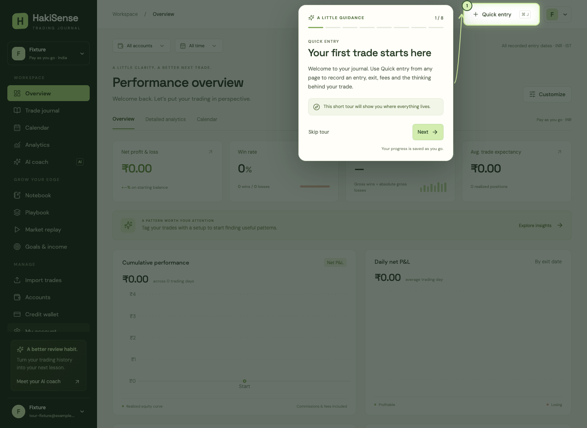
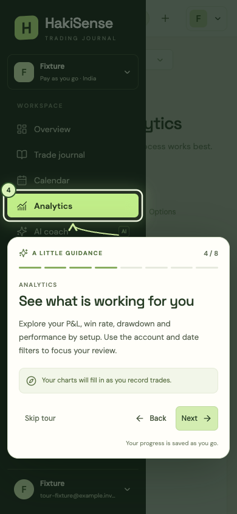

# First-login guided tour

The first authenticated workspace now opens an eight-step tour: Quick entry → Trade journal / Add trade → Import trades → Analytics → Calendar → AI coach → Trading accounts → Credit wallet. It highlights real controls with a spotlight, numbered marker and arrow. Next, Back, Skip tour and Finish are keyboard accessible. Escape saves a skip. Finish opens the trade journal.

## When it appears

- Provisioning a user's first workspace creates an `onboarding` record alongside their initial preferences in `journal.settings`. This happens after verified sign-in, including sign-in after email confirmation, not on the public registration form.
- A new record is `pending`. Next starts the tour and saves the next step. Reloading or signing in on another device resumes saved progress.
- Skip and Finish persist `skipped` or `completed`, so later sign-ins do not open the tour again.
- Accounts with existing preferences but no onboarding record predate this feature and return `not_required`. They are not interrupted by rollout. A profile created administratively without a provisioned workspace still receives the first-workspace tour.
- All users can explicitly start again from **My account → Help & customer care → Restart guided tour**.
- Automatic start waits for a normal workspace page. It does not interrupt initial entry into account security, administration, Help or a payment-return URL. An unfinished tour also resumes from Accounts or Wallet when no query string is present, including a refresh immediately after saving but before the browser navigates to the next page.
- A new tour waits while a trade editor/detail is open. Background shortcuts cannot open a trade editor over a modal dialog.

## Stored state and API

`journal.settings` already has a composite `(user_id, key)` primary key, forced row-level security and the restricted backend role's grants. The feature uses this existing structure; no schema migration, new grants, browser database access or auth metadata fields are required.

```json
{
  "version": 1,
  "status": "in_progress",
  "step": "analytics",
  "revision": 3,
  "started_at": "2026-09-14T00:00:00+00:00",
  "finished_at": null
}
```

A boolean alone would lose the difference between skipping and finishing, the resume location, and which tour was seen. A versioned state also lets a future tour use an explicit rollout policy instead of silently resetting everyone. Version 1 clients do not automatically open an unknown tour version.

`GET /api/workspace` includes the state under `onboarding`. `GET /api/onboarding` refreshes just that state. `PUT /api/onboarding` accepts only:

```json
{"version": 1, "revision": 3, "action": "next"}
```

Allowed actions are `next`, `back`, `skip`, `complete`, and `restart`. The server chooses the resulting step and timestamps. It rejects unknown fields, arbitrary state writes, invalid transitions, unsupported versions and unauthenticated requests. There is no accepted user ID in the payload. The generic settings endpoint cannot write onboarding state.

Writes take the existing profile row lock and check the supplied revision before changing anything. Stale/duplicate requests return HTTP 409 and the browser reloads current progress. This prevents a delayed Next request from undoing a skip, completion or restart. The browser disables buttons during a save and advances only after success. Same-origin tabs receive a notification through BroadcastChannel and fetch the authoritative state; focus/visibility changes also refresh it. Cross-device progress is read on workspace load or focus; it is not continuously streamed.

Tour requests time out after ten seconds. If a save fails, the current step stays open with a retry message. “Close for now” releases the overlay without pretending the database saved a skip; unfinished progress can resume later. No tour state is stored in localStorage.

## Frontend behavior

`src/Onboarding.tsx` owns the controller, Help launcher, step definitions and overlay. `WorkspaceApp` provides account state and mobile navigation control. Stable `data-tour` attributes identify the actual sidebar links, Quick entry and Add trade buttons.

The overlay uses a native modal dialog to keep keyboard focus inside the tour and prevent accidental background actions. It restores focus and scrolling on close. Highlights track navigation, scrolling, resizing and late-rendered content. On mobile, the relevant menu opens and its target scrolls into view. The card fits beside, above or below the target; when space is limited, its contents scroll. System and account reduced-motion preferences disable the halo animation.

The tour explains features and navigates to their pages. It does not create trades, import files, submit AI requests or initiate checkout. Ordinary page data requests still occur.

## Verification

- `npm run build`: TypeScript and production build. The existing large-chunk warning remains.
- `.venv/bin/python scripts/smoke.py`: 38 offline backend checks, including seven onboarding cases for authentication, validation, tenant isolation, first provisioning, resume/completion, rollout, restart, and stale/duplicate writes.
- `.venv/bin/python scripts/verify_onboarding_db.py`: real PostgreSQL provisioning, save/reload in separate ORM sessions, and cross-user read/update/insert denial under `hakisense_api`. Uses temporary fixtures and rolls back the outer transaction, including all temporary auth users. Requires the configured migration connection.
- Browser checks use an isolated SQLite API and synthetic browser auth session, not a customer account. They exercise real React pages and API transitions, all eight steps, Back, reload/resume, Finish, Skip, Help restart, failed-save retry, Escape, keyboard focus trapping, cross-tab updates, reduced motion, and desktop/mobile positioning down to 320 pixels. Reloads during the Accounts-to-Wallet transition are covered. Real Supabase email delivery and physical mobile devices are outside these checks.

Deploy backend and frontend together through the existing application workflow. No database migration or account backfill is needed. The existing backend process must load the updated Python modules before the new frontend can use the endpoints.

## Screenshots from the isolated preview




